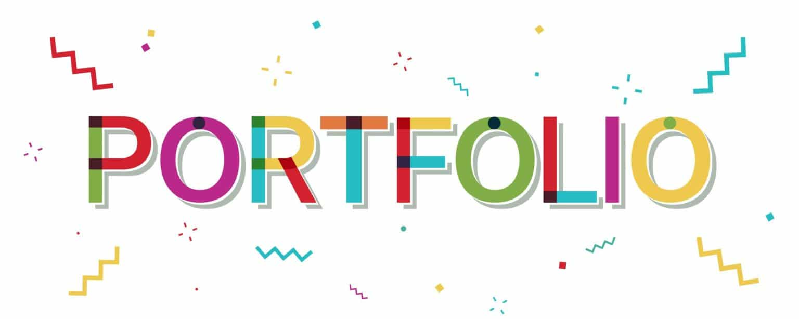

# My portfolio

## Description

This project was a personal challenge, and it involved creating my portfolio website from scratch without using templates, using HTML, CSS, JavaScript, and their respective frameworks. The goal was to assess my skills with these technologies.

## License

## Notes and Suggestions

If you have any comments, suggestions, or questions, feel free to share them by opening a new issue. We appreciate community feedback and are open to continuous improvement of this project.

Thank you for your participation and your interest in this project!

## Contacts

For any questions or comments, please feel free to contact me at the following email address: sekoudabo884@gmail.com or by visiting my GitHub profile.
