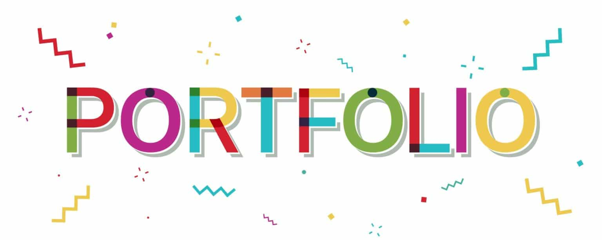

# Sékou Dabo — Academic Portfolio



[](https://ds4xai.github.io/my-portfolio/)
[](LICENSE)

---

## Overview

A personal academic portfolio built entirely from scratch — no templates, no CSS frameworks — as a deliberate exercise in front-end fundamentals. The goal was to produce a clean, research-oriented personal page that reflects the same standards of clarity and rigour applied in scientific work.

The site presents research activities, publications, projects, and teaching, with a design that prioritizes readability and accessibility across devices.

---

## Architecture

The project is intentionally structured as three separated concerns:

```
📁 my-portfolio/
├── CSS
│   └── style.css     — design system & responsive layout
├── DATABASE
│   └── recommendations.json
├── IMAGES              
│   ├── items.xx      — photo, banner, assets
├── index.html        — semantic HTML structure
├── JS
│   ├── data.js       — all content (publications, bio, links…)
│   └── script.js     — rendering engine
├── LICENSE
├── README.md
└── RESSOURCES
    └── CV
```

All content lives in `data.js`. Updating the portfolio only requires editing that single file — no build step, no dependencies, no framework.

---

## Features

- **Light / Dark theme** — persisted via `localStorage`
- **Responsive layout** — sidebar collapses to a mobile drawer on small screens
- **Publication filters** — filter by type (conference, workshop, journal)
- **Abstract toggle** — expandable abstracts per publication
- **Active nav tracking** — `IntersectionObserver`-based section highlighting
- **Zero dependencies** — pure HTML, CSS, JavaScript

---

## Tech Stack

| Layer | Choice | Rationale |
|---|---|---|
| Markup | HTML5 | Semantic, accessible structure |
| Styling | CSS3 (custom properties) | Theme switching without JS overhead |
| Logic | Vanilla JS (ES6+) | No build toolchain required |
| Fonts | Google Fonts (Cormorant Garamond, DM Mono, Source Serif 4) | Editorial, research-appropriate typography |

---

## Local Usage

No build step required. Simply clone and open:

```bash
git clone https://github.com/ds4xai/my-portfolio.git
cd my-portfolio
open index.html   # or serve with any static server
```

To update content, edit the `DATA` object in `data.js`.

---

## Notes & Contributions

Feedback, suggestions, or bug reports are welcome via [GitHub Issues](https://github.com/ds4xai/my-portfolio/issues).

---

## Contact

**Sékou Dabo** — PhD Candidate, ETIS Lab, CY Cergy Paris Université  
📧 [dabo.sekou@cyu.fr](mailto:dabo.sekou@cyu.fr)  
🔗 [GitHub](https://github.com/ds4xai) · [LinkedIn](https://www.linkedin.com/in/sekou-dabo) · [Google Scholar](https://scholar.google.com/citations?user=0uVPKNEAAAAJ&hl=fr)
